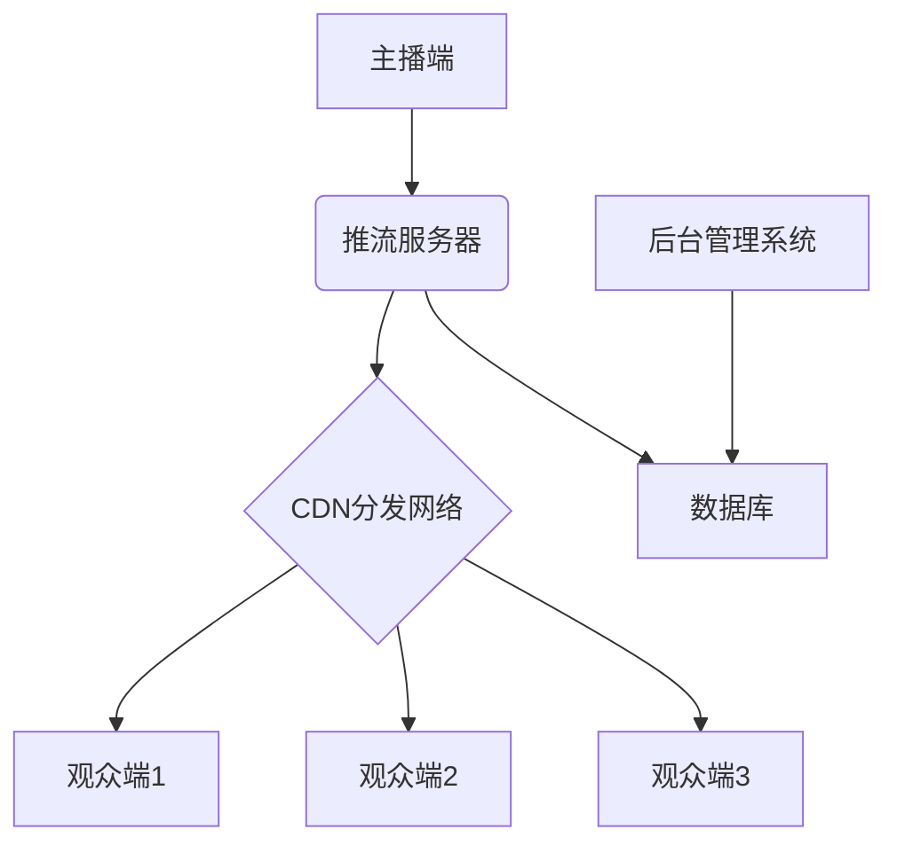

# 直播软件架构设计

## 1. 系统架构概览

## 2. 核心组件说明

### 2.1 主播端 (Streamer Client)
- 视频采集（摄像头/屏幕录制）
- 音频采集（麦克风）
- 编码（H.264/H.265, AAC）
- 推流（RTMP/HTTP-FLV/WebRTC）

### 2.2 推流服务器 (Streaming Server)
- 接收主播推流
- 转码（可选）
- 协议转换
- 流量控制

### 2.3 CDN分发网络
- 内容分发
- 负载均衡
- 边缘节点缓存

### 2.4 观众端 (Viewer Client)
- 拉流（HTTP-FLV/HLS/WebRTC）
- 解码播放
- 互动功能（聊天、点赞等）

### 2.5 后台管理系统
- 用户管理
- 直播间管理
- 内容审核
- 数据统计

## 3. 技术选型建议

### 3.1 后端技术栈
- 服务器: Node.js / Go / Java
- 数据库: MySQL + Redis
- 消息队列: RabbitMQ / Kafka
- 实时通信: WebSocket

### 3.2 流媒体服务器
- 开源方案: Nginx + nginx-rtmp-module / SRS / MediaSoup
- 商业方案: AWS IVS / Tencent Cloud Live / Alibaba Cloud Live

### 3.3 前端技术栈
- Web端: React/Vue + flv.js/hls.js
- 移动端: React Native / Flutter
- 桌面端: Electron

### 3.4 部署方案
- 云服务: AWS / 阿里云 / 腾讯云
- 容器化: Docker + Kubernetes